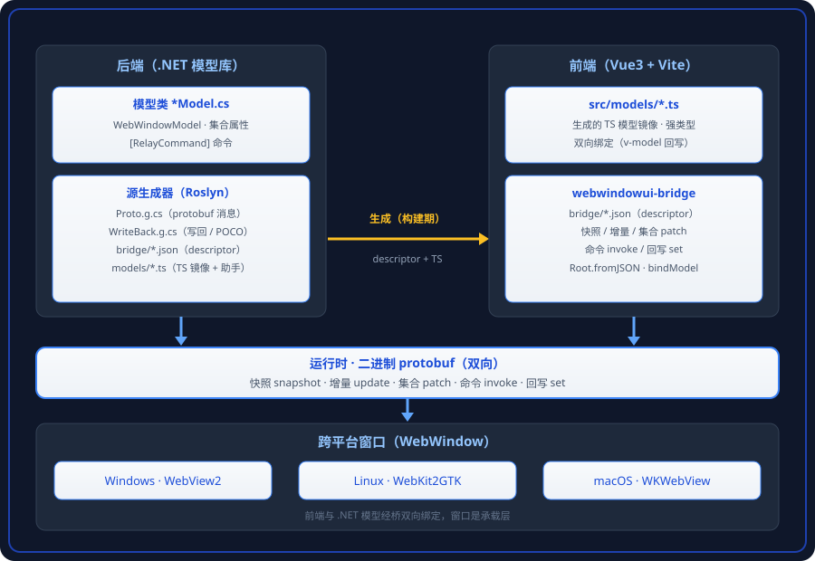

<p align="center">
  
</p>

# WebWindowUI

C# 后端 + WebView 渲染 + Vue 前端 的跨平台桌面应用框架。

前后端通信使用 **MVVM 模式**，从 .NET 模型自动生成通信协议（protobuf），通信使用**二进制交互**提升效率。



## 特性

- **自动生成通信协议**：`[ObservableProperty]` 字段 / 集合属性由 Roslyn 源生成器产出 protobuf 消息、`{Model}.Proto.g.cs` / `{Model}.WriteBack.g.cs`，前后端零手写协议。
- **双向绑定**：单属性变化自动推送增量；`ObservableCollection` / `ObservableDictionary` 原地增删自动差量补丁（CollectionPatch）；前端 `v-model` 回写属性。
- **MVVM 命令**：后端 `[RelayCommand]` 方法 → 生成前端命令方法，`CanExecute` 门控。
- **强类型 typed repeated**：`List<已知模型>` 双向绑定，前端得到强类型 TS 模型（序数键 / 命名键自动转换）。
- **多窗口共享模型广播**：同一模型实例绑多个窗口，属性变化全广播、远程回写排除源窗口。
- **跨平台**：Windows=WebView2 / Linux=WebKit2GTK（GTK3）/ macOS=WKWebView，另可选 **CEF（Chromium）**渲染内核（CefGlue.Next + CEF 150）。
- **单文件发布**：`dotnet publish` 出单个 exe（原生库内嵌 + PDB 内嵌 + 压缩）。

## 快速开始

### 方式一：从模板创建（推荐）

```bash
# 1. 安装模板包（需先打包，见「打包与发布」）
dotnet new install artifacts/WebWindowUI.Templates.0.1.0.nupkg

# 2. 生成三工程骨架
dotnet new webwindowui -n MyApp

# 3. 构建 + 运行
cd MyApp
dotnet build WebWindowUI.Sample.slnx -c Debug
dotnet run --project MyApp/MyApp.csproj
```

模板生成的三子工程：

```
MyApp/
├─ MyApp.Backend/    # .NET 模型库：放 *Model.cs 模型类（文件名即类名）
├─ MyApp.Frontend/   # Vue3 + Vite 前端：src/window/<窗口路径>/ 一页一窗口
└─ MyApp/            # 应用 exe：Program.cs + 窗口类
```

### 方式二：仓库内运行样例 / Demo

```bash
# 样例（每窗口一功能：main / todos / resources / multi / nested / nested-list / settings / about）
dotnet build Sample/WebWindowUI.Sample.slnx -c Debug
dotnet run --project Sample/WebWindowUI.Sample/WebWindowUI.Sample.csproj

# 功能 Demo（Demos/ 下，包模式端到端验证样本）
dotnet run --project Demos/WebWindowUI.Demo.Todo/WebWindowUI.Demo.Todo/WebWindowUI.Demo.Todo.csproj
dotnet run --project Demos/WebWindowUI.Demo.ImageGallery/WebWindowUI.Demo.ImageGallery/WebWindowUI.Demo.ImageGallery.csproj
```

> 前端需要 `npm install`（依赖与 vite 二进制在 `<App>.Frontend/` 层 node_modules），构建时自动执行。

## 三工程结构（核心约定）

每个应用是三个子工程，**角色由引用哪个标记类库证明**：

| 工程 | 引用标记包 | 职责 |
|------|-----------|------|
| `<App>.Backend` | `WebWindowUI.Backend` | 模型库：`*Model.cs` 模型类 → 自动生成 descriptor / TS / proto |
| `<App>.Frontend` | `WebWindowUI.Frontend` | 纯 Vue：`src/window/<窗口路径>/` 页面，vite 构建 |
| `<App>` | 都不引用 | 应用 exe：Program.cs + 窗口类，构建前端 + 传递 wwwroot |

- **模型即配置**：把模型类放进 Backend 工程（`MainWindowModel.cs` → 类 `MainWindowModel`，ProtoBase 自动 snake_case），构建即自动产出前端绑定所需的 descriptor（`src/bridge/*.json`）与 TS 镜像（`src/models/*.ts`）。想调整 TS 目录布局只需改 C# 命名空间。
- **窗口即页面**：`WebWindow` 子类构造传「窗口路径」，对应前端 `src/window/<窗口路径>/` 页面，首页地址自动推导。

## 示例模型（一个可双向绑定的模型）

```csharp
public partial class MainWindowModel : WebWindowModel
{
    [ObservableProperty]
    public partial string Title { get; set; } = "Hello";

    public ObservableCollection<TodoItemModel> Items { get; } = new();

    [RelayCommand]
    public void AddTitle() { Items.Add(new TodoItemModel { Name = Title }); }
}
```

前端：

```ts
import { bindMainWindowModel } from '../../models/MainWindowModel'
const model = bindMainWindowModel()          // 强类型，自动双向绑定
model.title = 'Hi'                            // 回写 .NET
model.addTitle()                              // 调用 [RelayCommand] 方法
```

## 工作原理

1. **生成器**（`WebWindowUI.Generator` console + `WebWindowUI.Generator.SourceGen` Roslyn 源生成器）读取 `*Model.cs`，产出：
   - `{Model}.Proto.g.cs`（protobuf 消息）、`{Model}.WriteBack.g.cs`（写回/命令/集合订阅/POCO 转换）
   - descriptor（`src/bridge/{proto_base}.json`，自包含基础信封）+ TS 镜像（`src/models/`，含 `bindXxx()` 助手）
2. **桥**（`webwindowui-bridge`，npm）在页面里建立二进制通道：快照 / 增量 update / 集合 patch / 命令 invoke / 回写 set，全部 protobuf 二进制。
3. **运行时**（`WebWindowUI` 核心库）：
   - Debug：vite 直产应用 `bin/wwwroot`，磁盘读取；Release：wwwroot 内嵌进前端 dll，从程序集资源读取。
   - `WebWindowModel` 订阅属性 / 集合变化 → 差量推送；前端回写 → `TrySetProperty` / `TryInvokeCommand`。
   - 命令执行在 WebView 平台线程（Windows STA），可安全弹系统原生对话框。

## 打包与发布

```bash
# 打四个 NuGet 包（WebWindowUI / WebWindowUI.Backend / WebWindowUI.Frontend / WebWindowUI.Templates）
dotnet pack -c Release -o artifacts/

# 单文件发布（示例：ImageGallery，FolderProfile 已配好单 exe）
dotnet publish Demos/WebWindowUI.Demo.ImageGallery/WebWindowUI.Demo.ImageGallery \
  -p:PublishProfile=FolderProfile
# → bin/Release/net10.0/publish/win-x64/WebWindowUI.Demo.ImageGallery.exe（单个 exe）
```

单文件发布要点（见 `FolderProfile.pubxml` + 仓库根 `Directory.Build.props`）：

- `PublishSingleFile` + `SelfContained` 打托管侧；`IncludeNativeLibrariesForSelfExtract=true` 内嵌 WPF 原生库与 WebView2Loader；`EnableCompressionInSingleFile=true` 压缩。
- `Directory.Build.props` 统一 `DebugType=embedded`（Release）：PDB 内嵌进程序集随包走，不散出独立 .pdb。

## 平台支持

| 平台 | 渲染 | 状态 |
|------|------|------|
| Windows | WebView2（Microsoft.Web.WebView2） | ✅ 已验证 |
| Windows (CEF) | CEF 150（CefGlue.Next NuGet 包，Chromium 内核；`UseCEF=true` 切换） | ✅ 已验证（chrome://gpu 全硬件加速 + F12 DevTools） |
| Linux | WebKit2GTK 4.1 / GTK3（手写 P/Invoke） | ✅ 已验证（Linux 主机 E2E） |
| macOS | WKWebView | ✅ 已验证（net10.0-macos + macos workload） |

平台由 `WebWindowUI.Platform.props` 的 `$(WWUIPlatform)` 统一选择（TFM + 编译符号）；CEF 平台由应用工程 `UseCEF=true` 切换（Windows 上替代 WebView2）。平台限制：macOS `SetIcon` no-op（窗口图标属 App Bundle）；Linux `SetIcon`（`gtk_window_set_icon`）与 `CanMinimize`/`CanMaximize`（`gdk_window_set_functions` 控制 WM 按钮）已真实现，Wayland 下 per-window 图标/按钮 best-effort。跨平台 E2E 测试目前覆盖 Windows/Linux（macOS 测试工程待补）。

> **CEF 平台注意**：应用工程必须嵌 `app.manifest`（`requestedExecutionLevel asInvoker` + `supportedOS` Win7/8/8.1/10 GUID）——缺应用清单时 chrome://gpu 渲染进程确定性 0xC0000409 崩溃（详见 `Platforms/WebWindowUI.Platforms.Cef/README.md`）。CEF 150 运行时由 `CefGlue.Next.Common` 包依赖链自动部署（chromiumembeddedframework.runtime.win-x64 150.0.11）。

### macOS 构建要求

macOS 应用使用 `net10.0-macos`，需要 Apple Silicon/Intel Mac + 已安装的 macos workload：

```bash
sudo dotnet workload install macos
dotnet build MyApp/MyApp.csproj -c Debug -p:WWUIPlatform=MacOS
```

- **Workload 与 Xcode 小版本错配**时加 `-p:ValidateXcodeVersion=false`（e.g. workload 要 Xcode 26.6、装了 26.5）。
- **应用 csproj 必须显式 `ApplicationId`**（bundle identifier）：`<ApplicationId Condition="'$(WWUIPlatform)' == 'MacOS'">com.xxx</ApplicationId>`。
- `RuntimeIdentifier`（osx-arm64/osx-x64）与 Release `SelfContained=true` 由 `WebWindowUI.Platform.props` 按宿主自动设置，无需手写。
- Debug 构建自动把 wwwroot 拷进 `.app` bundle 的 `Contents/MonoBundle`；Release wwwroot 内嵌进前端 dll。
- macOS 需要 Xcode（命令行工具）——`.NET Apple SDK` 依赖 Xcode 的编译工具链。

## 仓库结构

```
Core/                         # 核心库：WebWindowUI（入口聚合+平台引导）/ WebWindowUI.Core / 角色标记包
Platforms/                    # 平台实现：Windows（WebView2）/ Linux（WebKitGTK）/ MacOS（WKWebView）/ Cef（CEF 150）
Natives/                      # 原生共享层：Windows（Win32 P/Invoke）/ Linux（GTK3）
Generator/                    # 生成器：console（descriptor/TS）+ Roslyn 源生成器（写回/proto）
Templates/                    # dotnet new 模板包
Tests/                        # 协议 / Windows / Linux / macOS 测试工程
Sample/                       # 样例（每窗口一功能：main/todos/resources/multi/nested/nested-list/settings/about）
Demos/                        # 功能 Demo：Todo / SharedNotes / Monitor / ImageGallery
CefDemo/                      # CEF 直连测试应用（验证 chrome://gpu 全硬件加速 + F12）
```

## 测试

```bash
dotnet build WebWindowUI.slnx -c Debug   # 0 错误（MSB3277 WebView2 WindowsBase 为无害警告）
dotnet test  WebWindowUI.slnx -c Debug   # 按主机：Linux 130（协议 105 + Linux E2E 25）/ Windows 131（协议 105 + WebView2 19 + 剪贴板 7）
```

## 依赖

- .NET 10 SDK
- Node.js / npm（前端 vite 构建，rolldown 内核 vite 8）
- Windows：WebView2 Runtime（Win11 自带）；Linux：`libwebkit2gtk-4.1-0`（Ubuntu，WebKit2GTK 4.1 / GTK3）；macOS：`dotnet workload install macos` + Xcode（Apple SDK 依赖其编译工具链）
- CEF 平台：`CefGlue.Next` NuGet 包（CEF 150 代，由 vendored 源码 `third-party/CefGlue` 打包进 `artifacts` 本地源，随 CEF 平台包一起产出）+ `chromiumembeddedframework.runtime.win-x64`（150.0.11，包链自动部署运行时）
- NuGet：protobuf-net、CommunityToolkit.Mvvm（CPM 集中版本，见 `Directory.Packages.props`）
